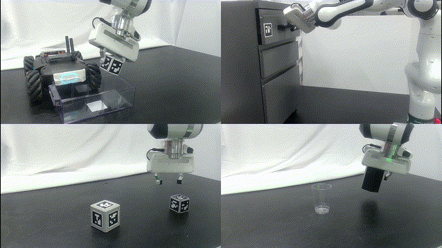
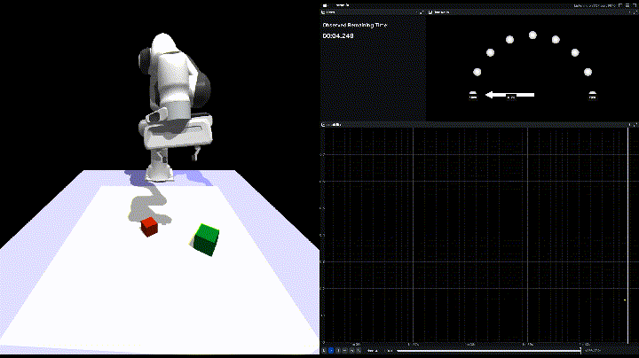

# Time as a Control Dimension in Robot Learning

[Yinsen Jia](https://yjia.net), [Boyuan Chen](http://boyuanchen.com) — Duke University

[Paper](https://arxiv.org/abs/2511.07654) ·
[Video](https://youtu.be/NwvgLdydJFk) ·
[Project website](http://generalroboticslab.com/TimeAwarePolicy)

This repository contains the implementation and paper artifacts for
Time-Aware Policy Learning. It includes three Isaac Gym tasks, the PPO-family
training code, N-P3O/PPO-Lagrangian/CPO variants, strict evaluation utilities,
paper checkpoints, and real-robot interfaces.

## Requirements

- Ubuntu 20.04 or 22.04
- NVIDIA GPU and a compatible driver
- Python 3.8
- At least 16 GB GPU memory for the default 16,384-environment training setup

Isaac Gym Preview 4 is bundled under the isaacgym directory. Consult
isaacgym/docs/index.html for NVIDIA's runtime and driver requirements.

## Installation

~~~bash
git clone https://github.com/generalroboticslab/TimeAwarePolicy.git
cd TimeAwarePolicy

conda create -n timeaware python=3.8
conda activate timeaware
export LD_LIBRARY_PATH="$CONDA_PREFIX/lib${LD_LIBRARY_PATH:+:$LD_LIBRARY_PATH}"
pip install -r requirements.txt -e isaacgym/python --no-cache-dir
~~~

Verify the installation and included artifacts without starting a simulator:

~~~bash
bash tests/release/check.sh
~~~

## Run a paper checkpoint

Rendering uses a Vulkan device ordinal, which can differ from the CUDA index.
Find the correct ordinal with:

~~~bash
vulkaninfo --summary
~~~

The interactive command uses ordinal 0 by default. Override it with
`--graphics_device_id DEVICE` when needed.

Cube stacking:

~~~bash
bash exec/TimeAwarePolicy/eval/interactive.sh \
  --task FrankaCubeStack
~~~

Granular-media pouring:

~~~bash
bash exec/TimeAwarePolicy/eval/interactive.sh \
  --task FrankaGmPour
~~~

Drawer opening:

~~~bash
bash exec/TimeAwarePolicy/eval/interactive.sh \
  --task FrankaCabinet
~~~

Use the up/down arrow keys to increase/decrease the time ratio by 0.1.

## Train

Training has four executable stages:

1. learn a task policy;
2. fine-tune a time-optimal policy;
3. distill it into a policy with temporal inputs;
4. optimize the time-aware CMDP objective.

See [docs/training.md](docs/training.md#training-protocol) for copy-paste
commands and the task-specific horizons.

## Validation experiments

The following optional studies are separate from the four-stage training
procedure used to produce a time-aware policy. Task-specific settings remain
in the saved run configurations and
[training guide](docs/training.md#training-protocol).
Set the shell variables shown in each command before running it.

### Initializer-quality sensitivity

Train one common initial policy per task, strictly evaluate its saved
candidates, and collect the selected Q40/Q60/Q80/Q95 checkpoints in one
initializer checkpoint set. Reuse this same set for every fine-tuning seed.
Start from the initial-policy command in the training guide and enable
candidate capture:

~~~bash
bash exec/TimeAwarePolicy/train/initial_policy.sh \
  --task "$TASK"

bash exec/TimeAwarePolicy/train/initializer_quality.sh \
  --task "$TASK" \
  --producer "$INITIAL_TRAINING_FOLDER" \
  --output-bank "$INITIALIZER_SET" \
  --execute
~~~

Without `--execute`, the command only prints the strict-evaluation commands it
would run. With `--execute`, it runs those evaluations, records the measured
held-out success, and creates the initializer checkpoint set. This set is
different from the temporal calibration bank created later.

Launch matched time-optimal refinements by setting `QUALITY` and `SEED` for
each run:

~~~bash
bash exec/TimeAwarePolicy/train/time_optimal.sh \
  --task "$TASK" \
  --checkpoint "$INITIALIZER_SET" \
  --index "quality_$QUALITY" \
  --seed "$SEED"
~~~

### CMDP solver comparison

Assume the temporal-input student, its fixed 1,000-configuration reference
bank, and the N-P3O validation baseline have already been produced. Hold those
inputs and all training settings fixed. Set `TASK`, `TEMPORAL_STUDENT`,
`METHOD`, and `SEED` before running:

~~~bash
bash exec/TimeAwarePolicy/train/time_aware.sh \
  --task "$TASK" \
  --checkpoint "$TEMPORAL_STUDENT" \
  --cmdp_method "$METHOD" --seed "$SEED"
~~~

See [docs/training.md](docs/training.md#training-protocol) for
candidate-selection details, the main stage-wise recipe, and solver-specific
defaults.

## Evaluate and plot

Strict evaluation reports task success and metrics conditioned on successful
episodes. Detailed evaluation protocols are documented separately.

See:

- [docs/evaluation.md](docs/evaluation.md) for strict evaluation commands and
  metric definitions;
- [docs/checkpoints.md](docs/checkpoints.md) for included artifacts and their
  provenance;
- [docs/reproducibility.md](docs/reproducibility.md) for determinism,
  randomization, and artifact-integrity notes; and
- [docs/results.md](docs/results.md) for versioned result profiles, preflight,
  and available evaluation figures.

Generate individual, seed-aggregate, and overview curves from a campaign
status/log snapshot with:

~~~bash
bash exec/TimeAwarePolicy/plot/run.sh training-curves \
  --campaign-dir /path/to/campaign
~~~

Project evaluation protocols and paper figures live under
`projects/TimeAwarePolicy/`. Versioned paper-result inputs are under
`projects/TimeAwarePolicy/paper/configs/`.

Training writes to train_res/TASK_NAME and evaluation writes to
eval_res/TASK_NAME unless the corresponding directory option is overridden.

## Tests

The unit suite runs without a GPU:

~~~bash
bash tests/run_unit.sh
~~~

Full simulator smoke tests require Isaac Gym and an NVIDIA GPU.

Run one environment rollout and optimizer update for every public task, while
keeping logs and the validation manifest outside the repository:

~~~bash
bash tests/release/smoke.sh \
  --gpu 0 --output-dir /tmp/timeaware-task-smokes
~~~

## Repository layout

~~~text
.
├── envs/                    # Simulation environments and assets
│   ├── assets/
│   └── isaacgymenvs/
├── core/                    # Reusable learning and evaluation implementation
│   ├── agents/              # Policy architecture and normalization
│   ├── training/            # Rollouts, PPO/CMDP updates, logging, checkpoints
│   ├── evaluation/          # Generic evaluator and visualization support
│   └── common/              # I/O, timing, tensors, and NumPy transforms
├── projects/
│   └── TimeAwarePolicy/     # Project CLIs, protocols, and paper analyses
│       ├── train.py
│       ├── eval.py
│       ├── plot.py
│       ├── initializer_quality/
│       ├── evaluation/
│       └── paper/
│           ├── configs/
│           └── figures/
├── exec/TimeAwarePolicy/    # Short, transparent shell entrypoints
│   ├── train/
│   ├── eval/
│   └── plot/
├── train_res/               # Bundled base and time-aware policies
│   ├── FrankaCabinet/
│   ├── FrankaCubeStack/
│   └── FrankaGmPour/
├── eval_res/                # Bundled temporal calibration banks
│   ├── FrankaCabinet/
│   ├── FrankaCubeStack/
│   └── FrankaGmPour/
├── real_robot/              # Camera, estimation, and robot communication
├── isaacgym/                # NVIDIA Isaac Gym Preview 4
├── docs/                    # Training, evaluation, and deployment guides
├── tests/                   # Unit, integration, and release validation
│   ├── unit/
│   ├── integration/
│   └── release/
├── requirements.txt         # Simulation dependencies
└── requirements-real.txt    # Additional real-robot dependencies
~~~

`projects/TimeAwarePolicy/paper/configs/bundled_files.json` verifies only
files shipped with this repository. The other configurations are used only by
the supplied paper-result tools. New checkpoints do not need to be added there.

## Real robot

Real deployment additionally requires the Franka controller stack, RealSense
drivers, camera extrinsic calibration, and optional hardware dependencies:

~~~bash
pip install -r requirements-real.txt --no-cache-dir
bash tests/release/check.sh --real-robot
~~~

The controller address is deliberately explicit; the public code does not
embed a lab-specific host. The current controller protocol uses Python object
serialization for compatibility with the external controller and must only be
used on a trusted, isolated network. The entrypoint is:

~~~bash
bash exec/TimeAwarePolicy/eval/run.sh \
  --num_envs 1 --real_robot \
  --controller_ip CONTROLLER_HOST \
  --checkpoint CHECKPOINT --index_episode best_rew \
  --par_configs_eval true \
  --goal_time 10
~~~

Hardware operation can cause injury or damage. Validate workspace limits,
emergency-stop behavior, calibration, and controller gains before enabling
motion. See [docs/real_robot.md](docs/real_robot.md) for the controller
protocol, calibration layout, dry-run procedure, and recording options.

## License

The repository is released under
[CC BY-NC-ND 4.0](LICENSE-CC-BY-NC-ND-4.0.md). Duke University has filed
patent rights associated with this work. For additional rights, contact
Duke's Office for Translation and Commercialization and reference
OTC DU9041PROV.

NVIDIA Isaac Gym Preview 4 is proprietary software. Its original license is
retained verbatim at
[isaacgym/python/LICENSE.txt](isaacgym/python/LICENSE.txt); use, modification,
and redistribution of `isaacgym/` are governed by those terms rather than the
repository-level license.

Other bundled simulator, runtime, and asset notices are retained under
[`isaacgym/licenses/`](isaacgym/licenses/) and
[`envs/assets/licenses/`](envs/assets/licenses/). These third-party terms are
separate from the repository-level license and continue to govern their
respective code, native libraries, and assets.

## Citation

~~~bibtex
@misc{jia2025timecontrol,
  title={Time as a Control Dimension in Robot Learning},
  author={Yinsen Jia and Boyuan Chen},
  year={2025},
  eprint={2511.07654},
  archivePrefix={arXiv},
  primaryClass={cs.RO},
  url={https://arxiv.org/abs/2511.07654}
}
~~~
